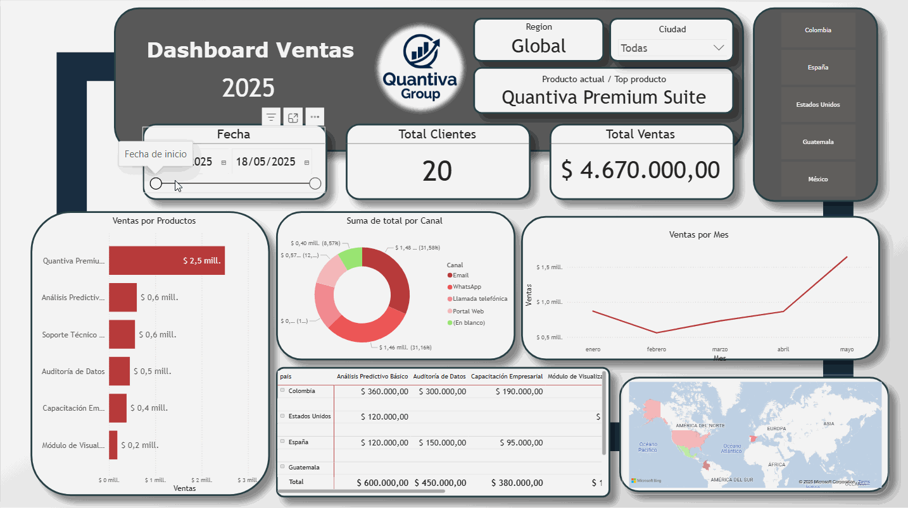

**Languages:** English | [Español](README_ES.md)

# Quantiva Group — Hybrid BI services platform

A professional BI project that combines a relational model in SQL Server with an optimized Power BI dashboard, designed for clarity and performance. The architecture is built to scale with a NoSQL layer in MongoDB Atlas, adding flexible feedback/log data with SQL snapshots to keep reporting stable.

---

## Business context

Quantiva Group delivers business intelligence services that turn data into decisions. We provide real, precise, and easy-to-understand information to tell stories with data: we reduce analysis time, improve decision-making, and strengthen long-term sustainability for companies that use our platform.

---

## Architecture and technologies

- **Relational core:** SQL Server + SSMS (clients, products, sales, segments, contact channels, regions).
- **Visualization:** Power BI with DAX measures and curated visuals for a clear narrative.
- **NoSQL scalability (planned):** MongoDB Atlas for feedback, logs, and telemetry; periodic snapshots back to SQL for stable reporting.
- **Automation (planned):** Python for ETL, loading/snapshots, and scheduled tasks.

> Suggested diagram: docs/architecture.svg (SQL Server → Power BI; MongoDB Atlas → SQL snapshots → Power BI)

---

## Dashboard components

- **Main tables:** clients, products, sales, segments, contact_channels, regions.
- **Key DAX measures:** Current Country, Current Product, Current Year.
- **Visuals and controls:**
  - **Slicers:** time (between) and dimensions (country, product, segment).
  - **Cards:** main KPIs (sales, units, satisfaction).
  - **Charts:** donut, clustered bar, column, line.
  - **Choropleth map:** geographic distribution by region/country.

> Screenshots:
> - docs/screenshots/dashboard-main-page.png
> - docs/screenshots/sql-data-model.png
> - docs/screenshots/atlas-feedback.png (once NoSQL is integrated)

---

### Interactive Demo

---

## How to run (reproducible steps)

1. **Prepare SQL Server**
   - **Create database:** start SQL Server and open SSMS.
   - **Run scripts:** execute in order:
     - sql/01_schema.sql
     - sql/02_constraints_indexes.sql
     - sql/03_seed_regions_products.sql

2. **Load sample data**
   - **Sales and clients:** place CSVs under data-samples/ and import via SSMS or use insert scripts (optional).
   - **Verify relations:** confirm foreign keys and basic record counts.

3. **Configure Power BI**
   - **Connect:** open the .pbix (if applicable) or create a new report and connect to SQL Server (DirectQuery or Import).
   - **DAX measures:** add the measures from dax/ (Current Country, Current Product, Current Year).
   - **Visuals:** replicate the dashboard layout or load the preconfigured model.

4. **(Optional) Integrate NoSQL with Atlas**
   - **Collections:** create feedback_clients and support_logs in Atlas (docs/screenshots/atlas-feedback.png).
   - **Snapshots to SQL:** schedule a Python task to summarize feedback into support tables (product_snapshots) and consume them in Power BI.

5. **Final validation**
   - **KPIs:** check consistency in cards.
   - **Slicers:** test time filter and country/product segmentation.
   - **Performance:** confirm load times and smooth navigation.

---

## Roadmap and versions

- **v1.0 (current):** Relational model in SQL Server + complete Power BI dashboard with DAX measures.
- **v1.1 (planned):** MongoDB Atlas integration (feedback/logs) + snapshots to SQL.
- **v1.2 (planned):** Python automation (ETL, loading/snapshots, scheduling).
- **v1.3 (planned):** Advanced storytelling visuals and role-based views (sales/support/management).

---

## 📜 License
This project is licensed under the MIT License. See [LICENSE.md](LICENSE.md) for details.

---

## Author and contact

- **Author:** Kevin Ochoa — Itagüí, Colombia  
- **LinkedIn:** www.linkedin.com/in/kevin-andres-ochoa-gallego-406519255  
- **Email:** keviin2396@gmail.com  
- **Tech:** SQL Server, SSMS, Power BI, DAX, MongoDB Atlas (planned), Python (planned)
